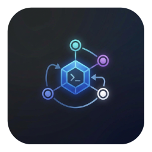
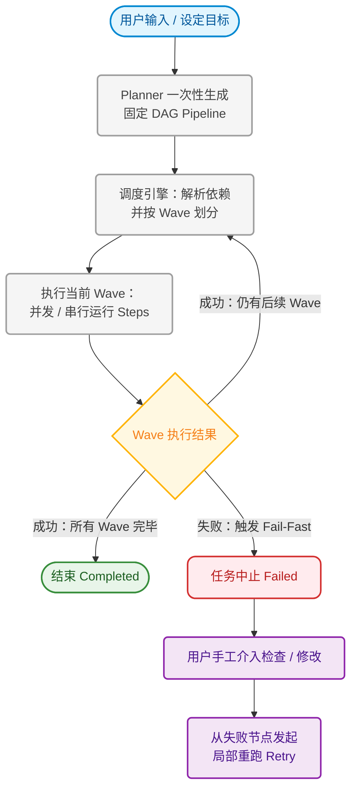
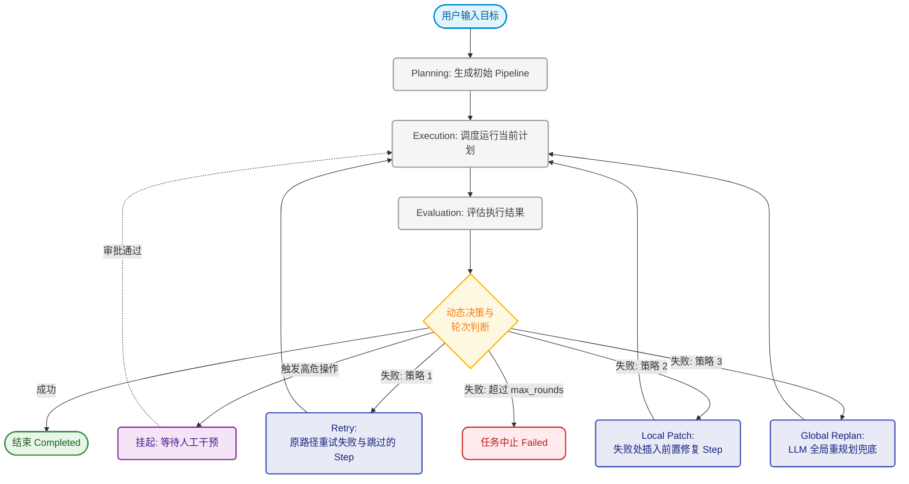
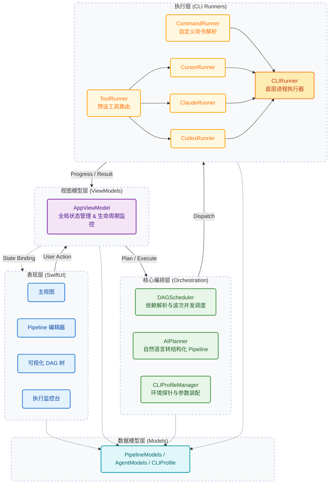

<div align="center">
  
  <h1>AgentCrew</h1>
  <p><b>一个面向 macOS 的本地 AI CLI 编排工作台（Orchestration Workbench）</b></p>
  
  <p>将 <code>Codex</code>、<code>Claude</code>、<code>Cursor-Agent</code> 等多种 AI 工具无缝组织成可视化工作流，在同一个项目中完成<b>实现、审查、修复、验证与人工重试</b>的完整闭环。</p>

  <p>
    <a href="https://developer.apple.com/macos/"></a>
    <a href="https://swift.org"></a>
    <a href="LICENSE"></a>
  </p>
</div>

---

## ✨ 核心亮点 (Key Features)

AgentCrew 并非要替代某一个具体的 AI 聊天工具，而是提供一个统一的 **Orchestration Layer**，让多种 AI CLI 能以更稳定、可复用、可观察的方式协作。

### 🔄 独创双引擎驱动：Pipeline 与 Agent 模式并存
同一任务可自由在两种模式间切换，兼顾**执行效率**与**智能闭环**：
- **⚡️ Pipeline 模式**：基于静态 DAG 工作流，执行路径极短。适合目标明确、步骤固定、追求速度与成本控制的标准化任务。
- **🧠 Agent 模式**：基于多轮动态执行（Plan -> Execute -> Evaluate -> Replan）。支持自动诊断失败原因、自动补齐修复步骤，并在高风险操作前（如删除、大规模重构）挂起等待**人工审批 (Human-in-the-loop)**。

### 🌊 DAG 波次调度与并发执行
摒弃死板的全串行执行。AgentCrew 自动解析任务步骤之间的显式依赖（Run After）与隐式依赖（Sequential Stage），将可并行的步骤打包成「Wave (波次)」，**最大化利用并发性能**，大幅缩短长链路任务的等待时间。

### 🪄 AI 自动生成工作流 (Auto-Planner)
只需输入一句话自然语言（如：“给项目新增 JWT 用户认证与单测”），系统会自动为你拆解出 `Implement -> Review -> Fix -> Verify` 的结构化步骤，并自动分配合适的底层 AI 工具。

### 🛠️ 多模型 & 多 CLI 混合编排
- 深度兼容 `Cursor/cursor-agent`、`Claude`、`Codex`。
- 支持混合编排：例如用 Cursor 编写代码，用 Claude 进行深度 Review，再用 Codex 运行验证脚本。
- **极简 CLI 配置**：提供一键开关，轻松在开源版与内部特供版 CLI 命令间无缝切换，内置环境探针自动完成路径解析。

### 📊 模式洞察与智能推荐 (Mode Insights & Recommendation)
- **智能模式推荐**：在任务创建前，根据任务复杂度、风险等级、多工具协作需求等维度进行评分，自动为你推荐最合适的执行模式（Agent 或 Pipeline），并在执行中提供动态切换建议。
- **Mode Insights 分析大盘**：内置运行数据分析看板，可视化展示推荐采纳率、模式分布与 7 日趋势。支持导出详细日志，辅助团队复盘与引擎调优。

### 💻 极致的 macOS 原生体验
- 基于 SwiftUI 构建，运行轻量、流畅。
- 可视化 Flowchart、全链路执行监控、本地系统通知。

---

## 🎯 典型使用场景 (Use Cases)

1. **自动化工作台**：把团队常用的 “实现代码 -> 代码 Review -> 修复问题 -> 跑通验证” 固化为可复用的标准 Pipeline。
2. **长链路协作**：在同一个项目里，让 Claude 负责写文档，Cursor 负责写代码，自动化脚本负责构建，一步到位。
3. **安全闭环**：在高危任务（如数据库迁移）中使用 Agent 模式，强制设置 `waitingHuman` 节点，由人工审查生成的变更后再继续执行。
4. **局部重试**：当长达几十步的 Pipeline 在最后一步失败时，无需从头再来，支持**按 Stage 或单 Step 原地重跑**。

---

## 🆚 运行模式对比

| 维度 | ⚡️ Pipeline 模式 | 🧠 Agent 模式 |
|------|-------------------|---------------|
| **适用场景** | 任务明确、步骤固定、追求速度与确定性 | 需求模糊、需要反复“实现-审查-修复”的探索任务 |
| **计划生成** | 一次性固定生成 | 每轮动态重规划 (Re-planning) |
| **失败处理** | 任务中止，需人工修改流程后重跑 | 自动诊断并动态生成补救 (Patch) 与验证任务 |
| **协作方式** | 显式依赖的串行/并行执行 | 多角色协作 (Coder/Reviewer/Fixer) + 评估驱动 |
| **人工介入** | 失败中止后排查 | 支持中途状态拦截 (ask_human) 审批高危操作 |
| **成本/速度** | 🚀 更快、Token 消耗更低 | 🛡 更稳健、成功率更高 (相对耗时) |

---

## 📊 执行流程图

### ⚡️ Pipeline 模式（单次固定计划）



**Pipeline 执行机制说明：**
- **固定生成**：由 Planner 根据目标一次性生成所有 Stage 及其依赖关系的静态 DAG 图。
- **波次调度 (Wave)**：系统自动解析任务依赖，将互不阻塞的任务打包为 Wave，从而最大化并发执行效率。
- **提早失败 (Fail-Fast)**：一旦某个 Wave 发生严重错误，任务便提早中断，避免后续执行导致资源浪费。
- **局部重试**：如果任务中止，用户可在排查修正错误后，直接从失败节点或 Stage 重新发起局部重跑，无需从头开始。

### 🧠 Agent 模式（多轮智能闭环）



**Agent 渐进式故障恢复与自愈策略（基于代码实现的真实流转）：**
1. **第一轮 (Strategy: `originalPipeline`)**：运行最初规划的 Pipeline。
2. **第二轮 (Strategy: `retryFailedStage`)**：如果在第一轮失败，评估器并不会立刻大动干戈，而是生成一个只包含未通过或跳过 Step 的新 Stage 沿原路径重试（Retry）。
3. **第三轮 (Strategy: `localPatchInsert`)**：如果重跑依然失败，系统会触发 Local Patch 机制，提取失败报错并构建一个专门用于修复该前置问题的 Patch Step，将其安插在原失败 Step 的前面，确保其通过后再往下走。
4. **第四轮/兜底 (Strategy: `globalReplan`)**：如果局部 Patch 还搞不定，这时候才会触发基于 LLM 的 Global Replan，全局重新审视上下文进行大重构。
5. **彻底中止**：如果以上招数用尽且超过最大允许轮次（`maxRounds`），才会彻底 Abort 结束。

---

## 🚀 快速开始

### 1. 环境要求
- macOS 14.0+
- Swift 5.9+
- 已在终端中登录并配置好至少一种受支持的 AI CLI（如 Cursor, Claude, Codex）

你可以通过以下命令验证环境：
```bash
cursor-agent --version
claude --version
codex --version
```

### 2. 编译与运行
AgentCrew 是标准的 Swift Package 项目，你可以直接通过命令行启动，或使用 Xcode 打开。

**通过命令行：**
```bash
git clone https://github.com/YourUsername/AgentCrew.git
cd AgentCrew
swift run AgentCrew
```
*(或者使用 `swift build` 进行构建)*

**通过 Xcode：**
双击 `Package.swift` 打开项目，选择你的 Mac 作为运行目标，点击 `Run (Cmd + R)`。

### 3. 使用指南
1. 启动 App 后，前往 `Settings` 确认已正确检测到本机的 **CLI Profile**。
2. 点击侧边栏底部的 `+` 选择一个本地代码仓库。
3. 点击 **AI Pipeline Generator**，输入你的任务需求，或手动创建 Pipeline。
4. 在 Pipeline 编辑器中检查各个 Step 的 Tool 和 Prompt（命令会根据环境自动生成，也可在 Advanced 中手写覆盖）。
5. 在右上角选择 `Pipeline` 或 `Agent` 模式。
6. 点击 **Run** 开始见证奇迹！📈

---

## 🏗️ 项目架构

本项目采用 SwiftUI 编写，分层架构设计如下：



核心模块说明：
- `Services/DAGScheduler.swift`: 负责解析依赖关系与波次 (Wave) 并行调度。
- `Services/AIPlanner.swift`: 负责与大模型交互，将自然语言转化为结构化执行步骤。
- `Services/CLIProfileManager.swift`: 负责不同环境 CLI 命令参数的自适应装配。
- `ViewModels/AppViewModel.swift`: 全局状态管理、会话生命周期与模式回退分析。

---

## 🤝 参与贡献
欢迎提交 Issue 和 Pull Request！AgentCrew 仍处于快速演进阶段。
如果你希望增加新的 AI CLI 支持，或者改进 DAG 调度引擎，欢迎直接阅读源码或发起 Issue 与我们讨论。

## 📄 许可证 (License)
本项目采用 [MIT License](LICENSE) 开源，请自由地在个人或商业环境中使用。


