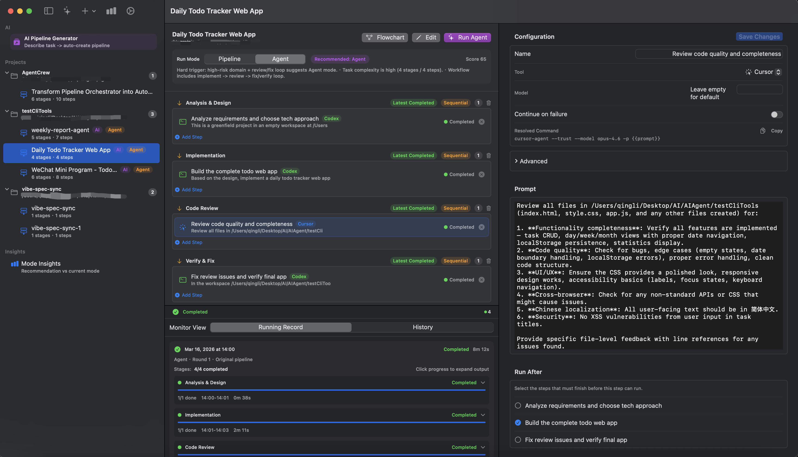
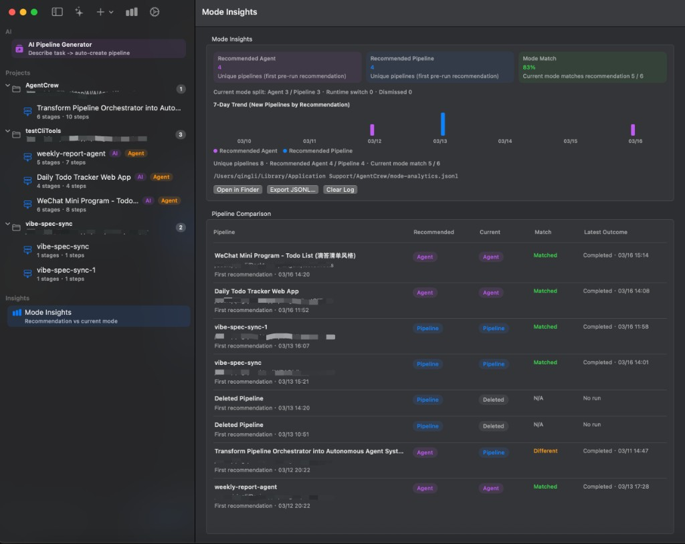

<div align="center">
  
  <h1>AgentCrew</h1>
  <p><b>A Universal CLI Orchestration Workbench for macOS</b></p>
  
  <p>Not only seamlessly orchestrate multiple AI tools like <code>Codex</code>, <code>Claude</code>, and <code>Cursor-Agent</code> into visual workflows, but also <b>mix and match ANY traditional CLI commands (e.g., git, npm, docker, ffmpeg)</b>, creating a complete closed-loop for <b>development, testing, deployment, and automated operations</b> locally.</p>

  <p>
    <a href="https://developer.apple.com/macos/"></a>
    <a href="https://swift.org"></a>
    <a href="LICENSE"></a>
  </p>

  <p>
    <b>English</b> | <a href="README.md">简体中文</a>
  </p>
</div>

---

## ✨ Key Features

AgentCrew is not meant to replace any specific AI chat tool, but rather to provide a unified **Orchestration Layer**, allowing multiple AI CLIs to collaborate in a more stable, reusable, and observable manner.

### 💻 Ultimate Native macOS Experience
- Built with SwiftUI for a lightweight and fluid experience.
- Visual Flowcharts, full-chain execution monitoring, and local system notifications.



### 🔄 Dual Engine Architecture: Pipeline & Agent Modes
Switch freely between two modes for the same task, balancing **execution efficiency** and **intelligent closed-loops**:
- **⚡️ Pipeline Mode**: Based on static DAG workflows with the shortest execution path. Ideal for standardized tasks with clear goals, fixed steps, and a need for speed and cost control.
- **🧠 Agent Mode**: Based on multi-round dynamic execution (Plan -> Execute -> Evaluate -> Replan). Supports automatic failure diagnosis, dynamic patch step generation, and suspends for **Human-in-the-loop** approval before high-risk operations (e.g., massive refactoring, file deletion).

### 🌊 DAG Wave Scheduling & Concurrency
Say goodbye to rigid, purely sequential execution. AgentCrew automatically parses explicit dependencies (Run After) and implicit dependencies (Sequential Stage) between task steps, packing parallelizable steps into "Waves", **maximizing concurrency** and significantly reducing wait times for long-chain tasks.

### 🪄 AI Auto-Planner
Simply input a natural language requirement (e.g., "Add JWT user authentication and unit tests to the project"), and the system will automatically break it down into a structured `Implement -> Review -> Fix -> Verify` workflow, assigning the appropriate underlying AI tools.

### 🛠️ Multi-Model & Multi-CLI Hybrid Orchestration
- **Deep AI Tool Compatibility**: Natively supports LLM CLIs like `Cursor/cursor-agent`, `Claude`, and `Codex`.
- **Minimalist CLI Configuration**: Provides a one-click toggle to seamlessly switch between open-source and internal CLI commands, with a built-in environment probe for automatic path resolution.

### 🔌 Universal Orchestration: Native Support for ANY Traditional CLI
Breaking the "AI tools only" limitation, AgentCrew's underlying architecture features a powerful universal executor:
- **Seamless Integration**: Perfectly supports `git`, `npm`, `python`, `docker`, `ffmpeg`, or any command runnable in the macOS terminal.
- **Interoperability with LLMs**: Safely passes prompts or outputs from previous AI nodes to shell scripts via placeholders (`{{prompt}}`) or standard input (stdin).
- **Infinite Hybrid Orchestration**: For example, use Cursor to write code, run `npm run test` to verify, and if it fails, trigger the Agent to capture the error, ask Claude to analyze and generate a patch, and finally use a custom shell script to deploy.

### 📊 Mode Insights & Recommendation
- **Intelligent Mode Recommendation**: Before creating a task, scores it based on complexity, risk level, and multi-tool collaboration needs, automatically recommending the most suitable mode (Agent or Pipeline), and providing dynamic switching suggestions during execution.
- **Mode Insights Dashboard**: Built-in analytics dashboard visualizing recommendation adoption rates, mode distribution, and 7-day trends. Supports exporting detailed logs for team retrospectives and engine tuning.



---

## 🎯 Typical Use Cases

Breaking the "AI tools only" boundary, AgentCrew is also an enhanced, localized `Jenkins` or visual `Make` that supports dynamic LLM planning and state management.

### 🤖 AI Development Closed-Loop
1. **Automated Workbench**: Solidify your team's common "Implement -> Review -> Fix -> Verify" process into a reusable standard Pipeline.
2. **Long-Chain Collaboration**: Within the same project, have Claude write documentation, Cursor write code, and automated scripts handle building—all in one go.
3. **Local Retry**: When a 30-step pipeline fails at the very end, there's no need to start over. Support for **in-place retries by Stage or single Step**.

### ⚡️ Universal Tasks & Orchestration
4. **Lightweight Local CI/CD (DevOps)**: Use Waves to concurrently execute `lint` and `test`. Upon success, sequentially execute `build`, call AI to generate a `CHANGELOG`, and suspend for manual (`waitingHuman`) approval before pushing to the cloud.
5. **Multimedia/Data Batch Processing**: Utilize DAG's maximum concurrency to launch dozens of processes (like `ffmpeg`) for time-consuming tasks, or concurrently scrape data before handing it over to LLMs for cleaning, analysis, and automated weekly report emailing.
6. **Intelligent Ops & Self-Healing**: Concurrently inspect local or remote services. When a metric anomaly causes a Step to fail, trigger the Agent mechanism to automatically pass the error to AI for a diagnostic report and repair command (Patch Step), executing recovery upon manual approval.

---

## 🆚 Execution Modes Comparison

| Dimension | ⚡️ Pipeline Mode | 🧠 Agent Mode |
|-----------|-------------------|---------------|
| **Best For** | Clear tasks, fixed steps, need for speed & certainty | Vague requirements, exploratory tasks needing "implement-review-fix" cycles |
| **Plan Gen** | One-time fixed generation | Dynamic re-planning per round |
| **Failure Handling** | Task aborts, requires manual fix and retry | Auto-diagnoses and dynamically generates Patch and verification tasks |
| **Collaboration** | Explicit dependency serial/parallel execution | Multi-role collaboration (Coder/Reviewer/Fixer) + Eval-driven |
| **Human Intervention**| Investigate after abort | Supports mid-flight interception (`ask_human`) for high-risk ops |
| **Cost/Speed** | 🚀 Faster, lower Token consumption | 🛡 More robust, higher success rate (relatively slower) |

---

## 🚀 Quick Start

### 1. Requirements
- macOS 14.0+
- Swift 5.9+
- At least one supported AI CLI logged in and configured in your terminal (e.g., Cursor, Claude, Codex).

Verify your environment with:
```bash
cursor-agent --version
claude --version
codex --version
```

### 2. Build & Run
AgentCrew is a standard Swift Package project.

**Via Command Line:**
```bash
git clone https://github.com/YourUsername/AgentCrew.git
cd AgentCrew
swift run AgentCrew
```

**Via Xcode:**
Double-click `Package.swift` to open the project, select your Mac as the run destination, and click `Run (Cmd + R)`.

### 3. Usage Guide
1. Launch the app and go to `Settings` to ensure your local **CLI Profile** is correctly detected.
2. Click the `+` at the bottom of the sidebar to select a local code repository.
3. Click **AI Pipeline Generator**, enter your task requirement, or manually create a Pipeline.
4. Review the Tool and Prompt for each Step in the Pipeline Editor (commands are auto-generated but can be overridden in Advanced settings).
5. Select `Pipeline` or `Agent` mode in the top right corner.
6. Click **Run** and watch the magic happen! 📈

---

## 🤝 Contributing
Issues and Pull Requests are welcome! AgentCrew is still evolving rapidly.
If you'd like to add support for new AI CLIs or improve the DAG scheduling engine, feel free to dive into the code or open an issue to discuss it.

## 📄 License
This project is licensed under the [Apache License 2.0](LICENSE).
