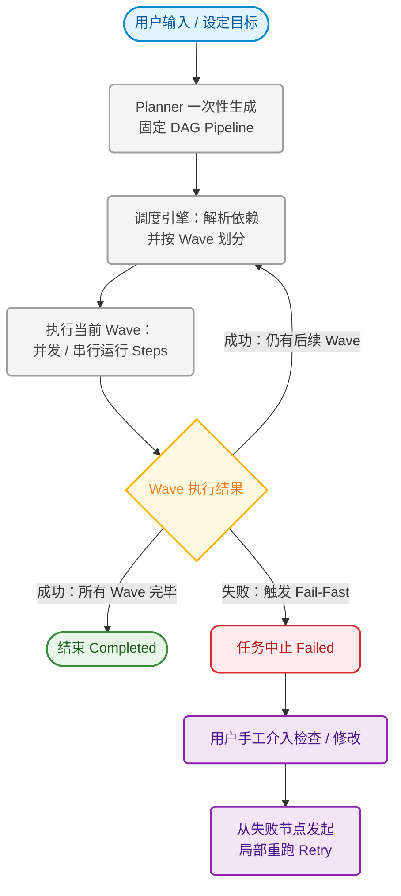
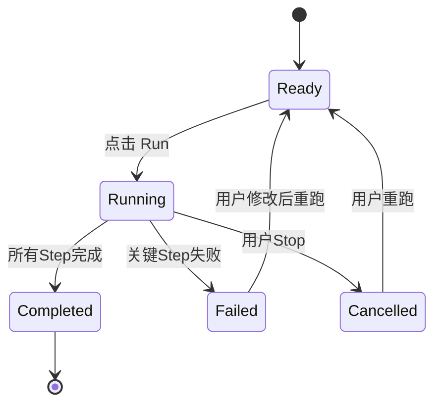
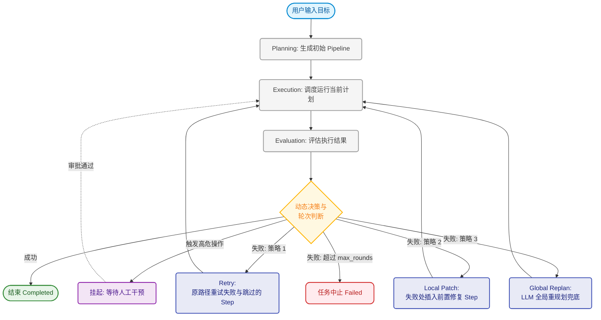
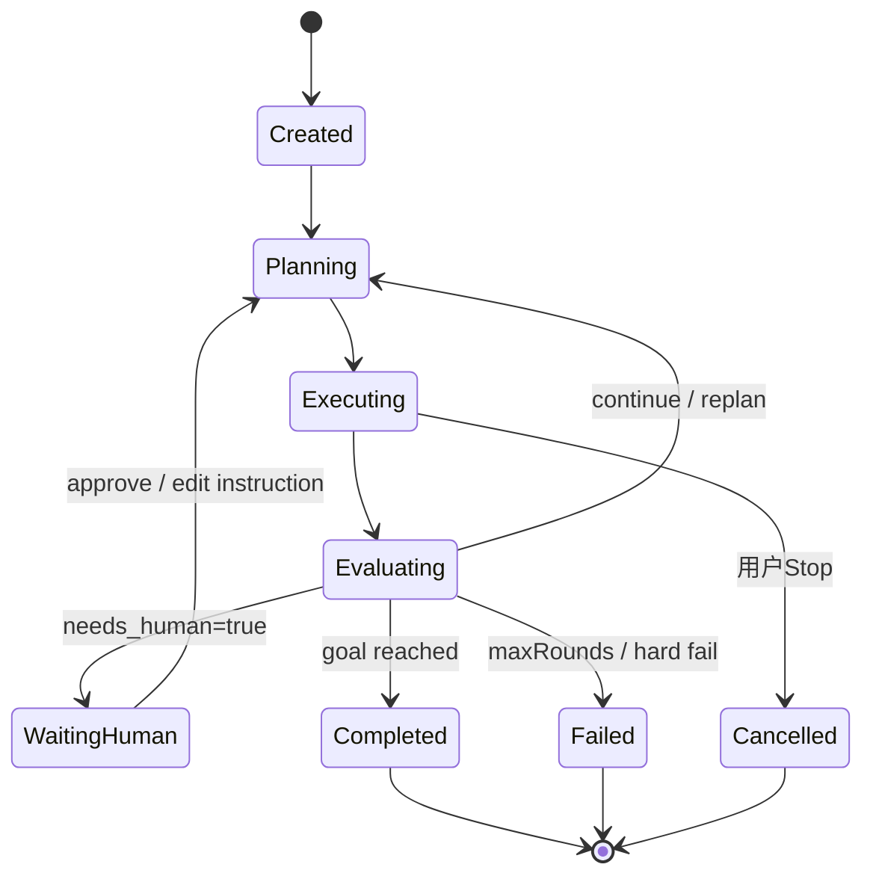

# 双模式流程对比文档：Pipeline vs Agent

## 文档日期

2026-03-12

## 背景

为了评估 Agent 能力是否值得引入，本次使用同一个任务进行对比：

**任务示例：**「给项目新增用户认证能力（登录 + JWT + 单测 + 安全审查）」。

目标是回答两个问题：

1. 在现有 Pipeline 能力基础上，引入 Agent 后能带来哪些提升？
2. 两种模式的执行流程和状态转移会发生什么变化？

---

## Pipeline 模式（当前）流程图

### 业务流程（一次性固定计划）

### 状态转移（会话级）

### 真实执行轨迹（该任务示例，4 轮上限）

- T0：生成固定步骤（Implement -> Review -> Verify）
- T1：Implement 成功
- T2：Review 发现高危问题并失败
- T3：Pipeline 结束（Failed），后续步骤跳过
- T4：用户手工补修复步骤并重跑

---

## Agent 模式（新增）流程图

### 业务流程（轮次化、可重规划）

### 状态转移（会话级）

### 真实执行轨迹（该任务示例）

- T0：Round1 计划（Coder 实现认证 + Reviewer 审查）
- T1：Coder 完成实现
- T2：Reviewer 发现 2 个高危问题（如 token 刷新缺失、输入校验不足）
- T3：Evaluator 判定 `replan`，自动进入下一轮
- T4：Round2 优先重试失败 stage（沿原步骤）
- T5：Round3 仍失败时，插入 Local Patch + 失败路径重跑
- T6：Round4 作为全局 Replan 兜底（必要时）
- T7：全部通过，自动 `finish`

---

## 对比结论

| 维度 | Pipeline 模式 | Agent 模式 |
|------|---------------|------------|
| 计划生成 | 一次性固定 | 每轮可重规划 |
| 失败处理 | 失败后通常结束，需要人工改流程 | 可自动诊断并补修复任务 |
| 协作方式 | 固定步骤串行/并行 | 角色协作 + 评估驱动 |
| 人工介入 | 多在失败后发生 | 可在中途关键节点介入 |
| 结果形态 | 以 step 日志为主 | 结构化结论 + 决策理由 |
| 速度/成本 | 更快、更省 | 更稳、更智能（通常更耗时/耗 token） |

---

## 能力提升总结（在现有基础上）

引入 Agent 后，并不是替代现有 Pipeline，而是增加一层「运行时决策能力」：

1. **从固定执行升级为自适应执行**：执行过程中可根据结果调整后续步骤。
2. **从失败中断升级为自动恢复**：发现问题后自动生成修复和验证回路。
3. **从日志回看升级为闭环交付**：提供更可追踪的“问题发现 -> 修复 -> 验证”链路。

---

## 模式选择建议（双模式并存）

| 场景 | 推荐模式 | 原因 |
|------|----------|------|
| 任务明确、步骤固定、追求速度 | Pipeline | 执行路径短，成本低，行为可预测 |
| 需求不确定、需要反复实现/审查/修复 | Agent | 支持动态决策和自动闭环 |
| 高风险改动（权限、删除、迁移） | Agent + 人工确认 | 可在关键节点暂停确认，降低风险 |

---

## 最终结论

保留双模式是当前最优解：

- **Pipeline 模式**保留确定性、低成本执行能力；
- **Agent 模式**提供动态重规划与协作闭环能力；
- 两者互补，而不是相互替代。

---

## 设计依据与参考文献

为避免“经验拍脑袋”式设计，本方案中的关键规则均参考公开的业内实践。以下给出设计点与依据映射，便于评审追溯。

### 设计点与依据映射

| 设计点 | 方案中的体现 | 依据（公开来源） |
|------|-------------|------------------|
| 双模式并存（Workflow + Agent） | 保留 Pipeline，同时新增 Agent | Anthropic 明确区分 Workflow 与 Agent，并建议先从简单方案开始，按需增加复杂度 |
| 轮次化 Plan -> Execute -> RePlan | Agent 模式采用“每轮规划 + 执行 + 评估 + 重规划” | LangGraph / LangChain 的 Plan-and-Execute 模式，支持执行后 revisiting plans |
| 人工确认与可恢复执行 | `ask_human` 状态、审批后恢复 | LangGraph 的 interrupt + checkpoint + thread_id 机制 |
| 多角色协作（Orchestrator + Specialists） | Coder/Reviewer/Fixer 分工，管理者协调 | AutoGen Group Chat：Manager 选择角色发言与协作轮次 |
| 结构化结果协议（JSON） | 推荐 `AgentResultEnvelope` 替代自由文本串联 | OpenAI Structured Outputs：以 schema 约束输出，提高可解析性与稳定性 |
| 安全控制与高风险审批 | 高风险动作建议启用人工确认 | OpenAI Agent 安全指南：tool approvals、structured outputs、guardrails |
| 规则参数需要持续校准 | 分数阈值、失败阈值、冷却机制作为可调参数 | OpenAI eval best practices：持续评估、迭代调优，不将初始阈值视为固定真理 |
| 产物传递优先于日志拼接 | 倾向传 artifact / summary，不直接传大段 stdout | GitHub Actions 将 artifacts 作为跨步骤/作业数据共享的主机制 |

### 参考文献

1. Anthropic, *Building effective agents*  
   https://www.anthropic.com/research/building-effective-agents

2. LangChain Blog, *Plan-and-Execute Agents*  
   https://blog.langchain.com/plan-and-execute-agents

3. LangGraph Docs, *Plan-and-Execute*（示例）  
   https://www.baihezi.com/mirrors/langgraph/tutorials/plan-and-execute/plan-and-execute/index.html

4. LangGraph Docs, *Human-in-the-loop / Interrupts*  
   https://docs.langchain.com/oss/python/langgraph/human-in-the-loop

5. Microsoft AutoGen Docs, *Group Chat*  
   https://microsoft.github.io/autogen/stable/user-guide/core-user-guide/design-patterns/group-chat.html

6. OpenAI, *Introducing Structured Outputs in the API*  
   https://openai.com/index/introducing-structured-outputs-in-the-api/

7. OpenAI Docs, *Safety in building agents*  
   https://developers.openai.com/api/docs/guides/agent-builder-safety/

8. OpenAI Docs, *Evaluation best practices*  
   https://developers.openai.com/api/docs/guides/evaluation-best-practices/

9. OpenAI Agents SDK Docs, *Guardrails*  
   https://openai.github.io/openai-agents-js/guides/guardrails/

10. GitHub Docs, *Store and share data with workflow artifacts*  
    https://docs.github.com/en/actions/how-tos/writing-workflows/choosing-what-your-workflow-does/storing-and-sharing-data-from-a-workflow

11. AWS Compute Blog, *Implementing Serverless Manual Approval Steps in AWS Step Functions and Amazon API Gateway*  
    https://aws.amazon.com/blogs/compute/implementing-serverless-manual-approval-steps-in-aws-step-functions-and-amazon-api-gateway/

### 评审说明

- 本文中的“阈值类参数”（例如建议分数阈值、失败次数阈值、冷却时间）属于**工程默认值**，不是行业统一标准。  
- 推荐在实现后，通过真实运行数据与 eval 集进行持续校准。
