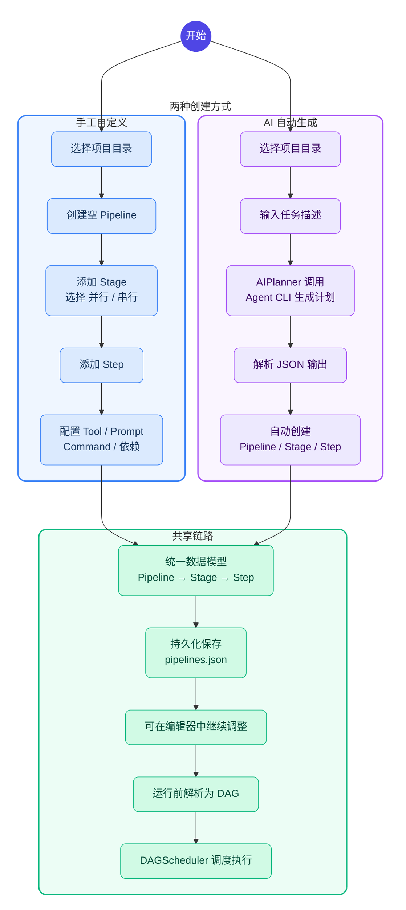

# Pipeline 创建方式对比流程图

> 推荐使用支持 Mermaid 的工具渲染（如 Cursor 预览、Typora、GitHub、VS Code Mermaid 插件等）。

## 讲解要点

- **蓝色区域（手工自定义）**：先建空壳，再逐层补 Stage 和 Step，最后配执行语义。
- **紫色区域（AI 自动生成）**：输入一句话任务描述，模型自动生成完整的 Pipeline 结构。
- **绿色区域（共享链路）**：无论哪种方式创建，最终都汇入同一套数据模型、同一个编辑器、同一个 DAG 调度器。
