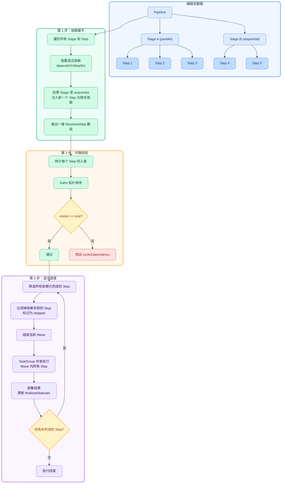
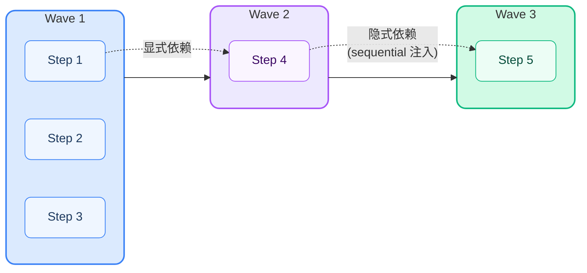

# Pipeline 运行前 DAG 解析流程

> 推荐使用支持 Mermaid 的工具渲染（如 Cursor 预览、Typora、GitHub、VS Code Mermaid 插件等）。

## 整体流程

## 波次调度示例

以上图中的 Pipeline 为例，假设 Step 4 显式依赖 Step 1：

## 讲解要点

- **蓝色区域（编辑态数据）**：用户在编辑器中搭建的 Pipeline → Stage → Step 树状结构，是静态的编辑态数据。
- **绿色区域（依赖展平）**：遍历所有 Stage/Step，收集显式依赖 `dependsOnStepIDs`；如果 Stage 模式为 sequential，自动将前一个 Step 注入为隐式依赖。产物是一维的 `[ResolvedStep]` 数组。
- **黄色区域（环路校验）**：用 Kahn 拓扑排序验证依赖图无环，有环则直接报错 `cyclicDependency`，不会进入执行。
- **紫色区域（波次调度）**：每轮动态计算当前所有"依赖已完成"的 Step，组成一个 Wave 并发执行；依赖失败的 Step 会被标记为 skipped 并传播到下游。循环直到所有 Step 都有终态。

## 一句话总结

> 先把树状的 Stage/Step 展平为一维数组并注入隐式依赖 → 用 Kahn 算法验证无环 → 然后每轮动态计算 ready step 组成 wave 并发执行，直到所有 step 都有终态。
