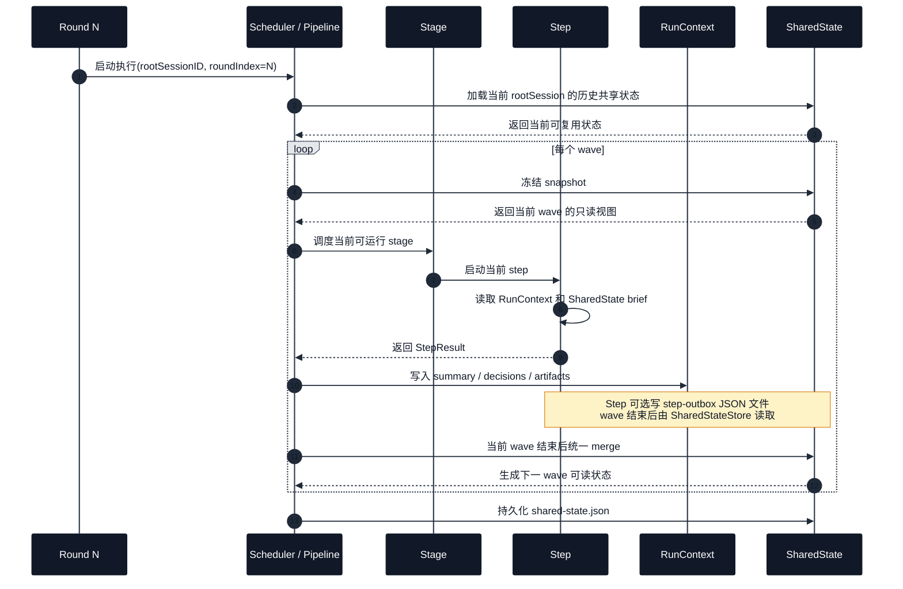
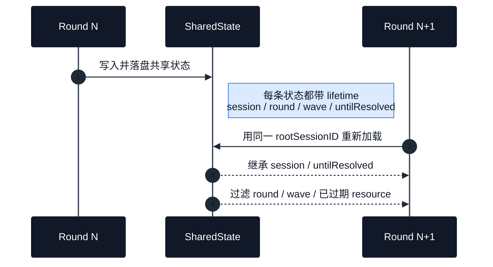

# 共享状态方案精简版

> 聚焦 AgentCrew 当前的跨 `step`、跨 `stage`、跨 `round` 共享状态设计。

## 一句话

这套方案用两层机制解决共享状态：

- `RunContextStore`：解决单次 pipeline 执行内，后续 `step` 如何精确读取前序依赖 `step` 的结构化结果。
- `SharedStateStore`：解决同一个 `rootSessionID` 下，可复用状态如何在后续 `step` 和后续 `round` 之间继续共享。

## 按 round / pipeline / stage / step 看状态流转

为了便于投屏展示，这里拆成两张图：一张讲 **同一 round 内如何流转**，一张讲 **跨 round 如何继承**。

### 图 1：同一 round 内

图 1 里有两条不同的回写路径：

- `StepResult -> RunContextStore`：把运行结果沉淀成 `summary`、`decisions`、`artifacts`、`output/error tail`
- `step-outbox JSON -> SharedStateStore`：把可复用共享状态交给共享状态层做 merge

### 图 2：跨 round 继承

### 图里最关键的 3 个语义

- `step` 运行时读到的是当前 wave 开始前冻结的 snapshot，不会读到同 wave 其他 step 刚写出的新状态。
- `stage` 本身不是状态仓库，它只是调度分组；真正共享的是 pipeline 级 merge 后的 `SharedState`。
- `round` 之间能否继承，取决于是否复用同一个 `rootSessionID`，以及状态的 `lifetime` 是否仍然有效。

## 四个层级分别负责什么

| 单位 | 作用 | 共享边界 |
| --- | --- | --- |
| `step` | 运行后产出结构化 delta，或由系统从输出中提取共享状态 | 默认只精确读取依赖链上的运行上下文 |
| `stage` | 执行分组，不是独立状态仓库 | 下游 stage 能否读到状态，取决于依赖关系和 `visibility` |
| `pipeline` | 当前 round 内统一持有 `RunContextStore` 和 `SharedStateStore` | `visibility = pipeline` 时可对整个 pipeline 可见 |
| `round` | agent 模式下的一轮执行 | 同一 `rootSessionID` 下可继承 `session` 级共享状态 |

## 传递的状态包含哪些数据

一句话：当前传递的不是完整 stdout，而是两层结构化状态。

- `RunContext`：单次 pipeline 运行内，给后续依赖 `step` 做精确 prompt 注入。
- `SharedState`：跨 `step`、跨 `stage`、跨 `round` 复用的结构化共享状态。

### 1. RunContext：单轮内的精确传值

每个已完成 `step` 会沉淀一份运行摘要，后续依赖它的 `step` 可以读取这些字段：

| 字段 | 含义 |
| --- | --- |
| `stepID` / `stepName` / `stageID` | 这份上下文来自哪个 step、哪个 stage |
| `status` / `exitCode` / `finishedAt` | 这个 step 的执行状态 |
| `summary` | 这个 step 做了什么 |
| `decisions[]` | 这个 step 产出的关键决策 |
| `artifacts[]` | 这个 step 产生或引用的关键文件/路径 |
| `outputTail` / `errorTail` | 原始输出和错误输出的最后一段，用于诊断 |

在 prompt 中，后续 step 主要能读取这些运行态：

- `summary`
- `decisions`
- `artifacts`
- `output.tail`
- `error.tail`
- `pipeline.failed_steps`
- `pipeline.last_failed.summary`

### 2. SharedState：跨 step / stage / round 的结构化复用

每条共享状态除了业务内容本身，还会带一组公共元数据：

| 元数据 | 作用 |
| --- | --- |
| `kind` | 这条状态属于哪一类 |
| `scope` | 这条状态作用于哪个问题域或对象 |
| `title` | 给人看的简短标题 |
| `status` | 当前状态是否 active / superseded / conflicted / resolved / expired |
| `visibility` | 谁可以看到这条状态 |
| `mutability` | 这条状态是否可被覆盖、追加或仅临时存在 |
| `lifetime` | 这条状态可以活多久 |
| `source` | 这条状态来自哪个 step / stage / round / wave |
| `supersedes` | 这条状态是否覆盖了历史状态 |

真正被传递的业务 payload 主要分 5 类：

| 类型 | 传递的内容 | 典型用途 |
| --- | --- | --- |
| `decision` | 决策内容、理由、约束、相关产物 | 保留关键方案选择 |
| `fact` | 事实陈述、证据、置信度 | 沉淀已确认事实 |
| `artifactRef` | 文件路径、文件角色、摘要 | 给后续步骤复用产物 |
| `issue` | 严重级别、问题摘要、细节、相关产物 | 记录待解决问题 |
| `resource` | 资源类型、值、过期时间 | 记录端口、临时目录等运行资源 |

### 3. Step 如何把状态写回来

优先路径是：`step` 执行结束后，按约定写 `step-outbox` JSON，把结构化状态显式上报给 `SharedStateStore`。

如果没有写出合法 JSON，系统会从 step 输出里做兜底提取，当前主要会尝试补出：

- `artifactRef`
- `decision`
- `fact`
- `issue`

### 4. 下游 step 实际读到的是什么

下游 step 读到的不是完整原始对象，而是面向 prompt 的“摘要视图”：

- `RunContext` 传的是摘要、决策、产物和输出尾部
- `SharedState` 传的是 decision / fact / artifact / issue / resource 的简化 brief
- 不会把完整 stdout 或整份 JSON 原样塞进 prompt

## 组会里最值得强调的 5 点

1. **不是把 stdout 直接串给下一个 step。** 当前方案尽量传递结构化状态，而不是过程日志。
2. **同一 wave 内先读后写。** 并行 step 读取的是 wave 开始时冻结的 snapshot，不会互相污染。
3. **跨 stage 共享不是靠 stage 自己存状态。** `stage` 只是调度分组，真正的共享发生在 pipeline 级 merge 后。
4. **跨 round 共享靠 `rootSessionID`。** 下一轮会重新加载同一个 `shared-state.json`。
5. **不是所有状态都会继承。** `session` / `untilResolved` 会保留；`round` / `wave` 会过期。

## 你可以用这句来总结

> AgentCrew 的共享状态本质上是“**单轮内用 RunContext 做精确传值，同 root session 下用 SharedState 做结构化沉淀与复用**”。

## 补充说明

- 当前对外最主要的共享可见性是 `pipeline` 和 `dependencyChain`。
- `stage` / `steps` 级可见性在底层模型里已支持，但目前不是主要对外约定。
- 共享状态的持久化位置是 `.agentcrew/runs/<rootSessionID>/shared-state.json`。
